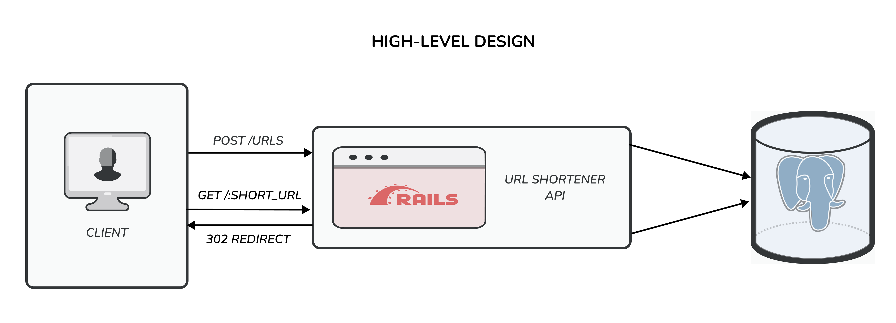

<div align="center">
  
</div>

# Bytesize - URL Shortener

A URL shortener application that creates unique short links, supports fast redirects, and tracks visit analytics.

For demo video, see [Bytesize Demo | Amad Zai](https://youtu.be/q9ao-LVQBLE)

> Originally developed on GitLab, for full history see [Bytesize | GitLab](https://gitlab.com/amadzai/bytesize)

## Setup and Dependencies

This project is a monorepo with **Ruby on Rails (API) + PostgreSQL** for the backend and **React (TS Vite) + Tailwind** for the frontend.

### Core Dependencies

- Backend: Docker (with Compose)
- Frontend and Extension: Node.js (LTS) and pnpm 9+

For full dependency details, see [`backend/Gemfile`](backend/Gemfile), [`frontend/package.json`](frontend/package.json), and [`extension/package.json`](extension/package.json).

### Local Setup

1. Start the backend (Rails API + PostgreSQL via Docker):

   ```bash
   cd backend
   docker compose -f docker-compose.dev.yml up --build
   ```

2. In a new terminal, start the frontend:

   ```bash
   cd frontend
   pnpm install
   pnpm dev
   ```

3. Open the app:
   - Frontend App: [http://localhost:5173](http://localhost:5173)
   - Backend API: [http://localhost:3000](http://localhost:3000)

4. _(Optional)_ Load the browser extension in Chrome:

   ```bash
   cd extension
   pnpm install
   pnpm build
   ```

   Then open `chrome://extensions`, enable **Developer mode**, click **Load unpacked**, and select `extension/dist/`.

### Workspace

If you are using VS Code/Cursor, open project using monorepo workspace file so project-specific settings and extensions (e.g., Ruby LSP) work as intended:

- [`monorepo.code-workspace`](monorepo.code-workspace)

### API Docs

After starting the backend in development, view API docs at:

- [http://localhost:3000/swagger](http://localhost:3000/swagger)

## Project Structure

```
bytesize/
├── backend/                          # Ruby on Rails API (URL shortener + analytics)
├── frontend/                         # React + TypeScript app
├── extension/                        # Chrome browser extension (MV3)
├── docs/                             # Project documentation and assets
├── .gitlab/                          # Merge Request template
```

For implementation details, see:

- [`backend/README.md`](backend/README.md)
- [`frontend/README.md`](frontend/README.md)
- [`extension/README.md`](extension/README.md)

For wiki on short URL path solution, see:

- [Short URL Path Solution](https://gitlab.com/amadzai/bytesize/-/wikis/Short-URL-Path-Solution)

## High-Level Design

This diagram shows the main request path between client, Rails API, and PostgreSQL.



For step-by-step request flows (URL shortening and redirect), see [`docs/diagrams/`](docs/diagrams/).

## Deployed URL

Bytesize App: [https://app.bytesize.now/](https://app.bytesize.now/)

Chrome Web Store Extension: [bytesize | Chrome Web Store](https://chromewebstore.google.com/detail/bytesize/jhcghcapaahkmmbgplmbmijkpjjemjol)

- The backend API is deployed on a Contabo VPS using Docker, with Nginx as a reverse proxy.
- The frontend is deployed on Vercel.
